  

---

  
  
  
  

---

### About me

Computer Science undergraduate at SRM University (9.39 GPA), specializing in backend systems, real-time architectures, and full-stack development. I build production-grade systems using MERN, Next.js, and FastAPI — with a strong focus on performance and reliability.

Currently seeking a **Software Engineering Internship**.

---

### Tech stack

---

### Featured projects

**[Real-Time Fraud Detection System](https://github.com/prajjwal-17)**  
Fintech fraud detection for UPI-style transactions using a hybrid ML + rule-based engine (Isolation Forest on 9 behavioral features). Sub-30ms end-to-end scoring with live dashboard via Socket.IO and Redis fallback for zero transaction loss.  
`React` `Node.js` `FastAPI` `MongoDB` `Redis` `scikit-learn` `Socket.IO`

**[DebateForge — AI Debate Platform](https://github.com/prajjwal-17)**  
Real-time multi-agent debate system with near-zero latency transitions. Prefetch pipeline reduces response delay by 30%. Context reduction improves token speed by 15%. Includes human-in-the-loop with fallacy detection.  
`Next.js` `FastAPI` `Ollama` `LLaMA 3.2` `TypeScript` `Web Speech API`

**[Graph-Based Data Exploration Platform](https://github.com/prajjwal-17)**  
Full-stack graph app to query and visualize relationships across 500+ interconnected entities. Automated ingestion pipelines convert unstructured data into Neo4j graph format with interactive D3.js visualizations.  
`Neo4j` `Node.js` `React` `D3.js` `Selenium`

---

### Experience

**Software Engineering Intern — DEAL-DRDO** *(May–Jul 2025, Dehradun)*  
- Designed a graph-based backend in Neo4j to analyze relationships across 500+ entities  
- Built a UDP file transfer system under 100 kbps bandwidth constraints, handling packet loss

---

### GitHub stats

  
  

  

